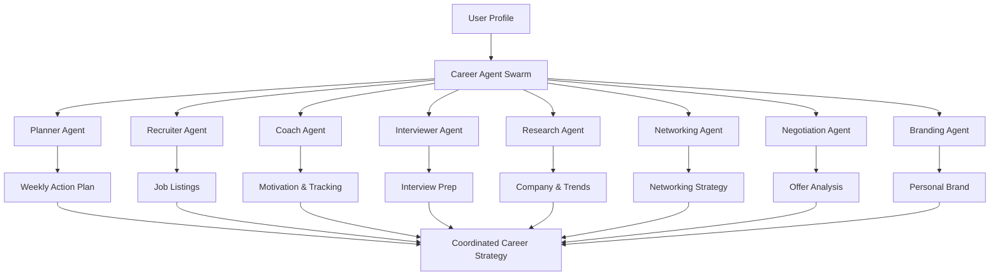

# Career Agent Swarm - Complete Guide

## Overview

The Career Agent Swarm is an advanced multi-agent AI system with **8 specialized agents** working together to help users achieve their career goals. Each agent has unique expertise and capabilities.

## Available Agents

### 1. 🗓️ Planner Agent
**Role:** Strategic career planning and goal setting

**Capabilities:**
- Creates personalized weekly action plans
- Analyzes skill gaps for target roles
- Balances applications, networking, and skill development
- Adjusts goals based on performance metrics

**Example Usage:**
```typescript
import { careerAgentSwarm, UserProfile } from './lib/careerAgentSwarm';

const profile: UserProfile = {
  fullName: 'John Doe',
  currentRole: 'Software Engineer',
  targetRole: 'Senior Software Engineer',
  skills: ['React', 'TypeScript', 'Node.js'],
  experience: [...],
  location: 'San Francisco'
};

const currentProgress = {
  applicationsSubmitted: 12,
  interviewsCompleted: 3,
  networkingEvents: 5,
  skillsLearned: ['System Design'],
  readinessScore: 75
};

// Run full swarm
const state = await careerAgentSwarm.runSwarm(profile, { 
  currentWeek: 0, 
  userProgress: currentProgress 
});
```

### 2. 💼 Recruiter Agent
**Role:** Job search and opportunity identification

**Capabilities:**
- Finds relevant job postings using RapidAPI JSearch
- Filters by location, salary, and remote preferences
- Ranks opportunities by match score
- Provides application recommendations

**Example Usage:**
```typescript
const jobs = await careerAgentSwarm.recruiterAgent.findRelevantJobs(profile, 10);
console.log(`Found ${jobs.length} matching jobs`);
```

### 3. 💪 Coach Agent
**Role:** Motivation, progress tracking, and career guidance

**Capabilities:**
- Generates personalized motivational messages
- Tracks weekly goal completion
- Provides actionable recommendations
- Analyzes conversion rates and success metrics

**Example Usage:**
```typescript
const insight = await careerAgentSwarm.getAgentInsight('coach', profile, {
  progress: currentProgress
});
console.log(insight.message);
```

### 4. 🎤 Interviewer Agent
**Role:** Interview preparation and readiness assessment

**Capabilities:**
- Assesses interview readiness (0-100 score)
- Generates role-specific mock questions
- Identifies strengths and improvement areas
- Recommends interview prep topics

**Example Usage:**
```typescript
const readiness = await careerAgentSwarm.interviewerAgent.assessReadiness(profile);
console.log(`Interview readiness: ${readiness.score}/100`);

const questions = await careerAgentSwarm.interviewerAgent.generateMockQuestions(profile, 5);
console.log('Practice these questions:', questions);
```

### 5. 🔍 Research Agent (NEW)
**Role:** Company and industry research

**Capabilities:**
- Analyzes company culture, pros/cons, and interview tips
- Tracks industry trends and emerging skills
- Provides market demand insights
- Forecasts future opportunities

**Example Usage:**
```typescript
// Research a specific company
const companyAnalysis = await careerAgentSwarm.researchCompany('Google', 'Software Engineer');
console.log('Company Overview:', companyAnalysis.overview);
console.log('Culture:', companyAnalysis.culture);
console.log('Interview Tips:', companyAnalysis.interviewTips);

// Analyze industry trends
const trends = await careerAgentSwarm.analyzeTrends('Technology', 'Data Scientist');
console.log('Current Trends:', trends.currentTrends);
console.log('Emerging Skills:', trends.emergingSkills);
console.log('Market Demand:', trends.marketDemand);
```

### 6. 🤝 Networking Agent (NEW)
**Role:** Professional networking strategy

**Capabilities:**
- Generates personalized LinkedIn outreach messages
- Creates weekly networking plans
- Provides message templates for various scenarios
- Suggests target groups and communities

**Example Usage:**
```typescript
// Generate LinkedIn connection message
const linkedInMessage = await careerAgentSwarm.generateLinkedInMessage(
  'Senior Product Manager',
  'Sarah Chen',
  'I noticed your recent post about product strategy and found it insightful'
);
console.log('Subject:', linkedInMessage.subject);
console.log('Message:', linkedInMessage.message);

// Get comprehensive networking plan
const networkingPlan = await careerAgentSwarm.getNetworkingPlan(profile);
console.log('Weekly Goals:', networkingPlan.weeklyGoals);
console.log('Target Groups:', networkingPlan.targetGroups);
console.log('Message Templates:', networkingPlan.templates);
```

### 7. 💰 Negotiation Agent (NEW)
**Role:** Salary negotiation and offer analysis

**Capabilities:**
- Analyzes job offers with market comparison
- Calculates total compensation value
- Assesses negotiation power
- Generates counter-offer scripts
- Provides stage-specific strategies

**Example Usage:**
```typescript
// Analyze a job offer
const offer = {
  baseSalary: 150000,
  bonus: 20000,
  equity: '0.1% RSUs',
  benefits: ['Health Insurance', '401k Match', 'Unlimited PTO'],
  location: 'San Francisco, CA',
  role: 'Senior Software Engineer',
  company: 'TechCorp'
};

const analysis = await careerAgentSwarm.analyzeSalaryOffer(offer, profile);
console.log('Analysis:', analysis.analysis);
console.log('Market Comparison:', analysis.marketComparison);
console.log('Total Compensation:', analysis.totalCompensation);
console.log('Negotiation Power:', analysis.negotiationPower);
console.log('Recommendations:', analysis.recommendations);
console.log('Counter-offer Script:', analysis.counterOfferScript);

// Get negotiation strategy for specific stage
const strategy = await careerAgentSwarm.getNegotiationStrategy(profile, 'offer-received');
console.log('Key Points:', strategy.keyPoints);
console.log('Scripts:', strategy.scripts);
console.log('Mistakes to Avoid:', strategy.mistakes);
```

### 8. 🎨 Branding Agent (NEW)
**Role:** Personal brand development and LinkedIn optimization

**Capabilities:**
- Analyzes current professional brand
- Identifies strengths and gaps
- Creates optimized LinkedIn profiles
- Generates compelling headlines and summaries
- Provides keyword optimization

**Example Usage:**
```typescript
// Analyze personal brand
const brandAnalysis = await careerAgentSwarm.analyzePersonalBrand(profile);
console.log('Current Brand:', brandAnalysis.currentBrand);
console.log('Strengths:', brandAnalysis.strengths);
console.log('Gaps:', brandAnalysis.gaps);
console.log('Target Brand:', brandAnalysis.targetBrand);
console.log('Action Plan:', brandAnalysis.actionPlan);

// Generate optimized LinkedIn profile
const linkedInProfile = await careerAgentSwarm.generateLinkedInProfile(profile);
console.log('Headline:', linkedInProfile.headline);
console.log('Summary:', linkedInProfile.summary);
console.log('Keywords:', linkedInProfile.keywordOptimization);
console.log('Call to Action:', linkedInProfile.callToAction);
```

## Agent Coordination

### Full Swarm Execution

The `runSwarm` method orchestrates all original 4 agents:

```typescript
const swarmState = await careerAgentSwarm.runSwarm(profile, previousState);

console.log('Week:', swarmState.currentWeek);
console.log('Weekly Plan:', swarmState.weeklyPlans[0]);
console.log('Agent Messages:', swarmState.agentConversation);
console.log('User Progress:', swarmState.userProgress);
```

### Individual Agent Insights

Query specific agents for targeted advice:

```typescript
// Get insight from any agent
const researchInsight = await careerAgentSwarm.getAgentInsight('researcher', profile, {
  companyName: 'Google'
});

const brandingInsight = await careerAgentSwarm.getAgentInsight('branding', profile);

const negotiatorInsight = await careerAgentSwarm.getAgentInsight('negotiator', profile, {
  offer: { /* offer details */ }
});
```

## Real-World Use Cases

### Use Case 1: Preparing for a Specific Company
```typescript
// 1. Research the company
const companyInfo = await careerAgentSwarm.researchCompany('Stripe', 'Backend Engineer');

// 2. Get interview questions
const questions = await careerAgentSwarm.interviewerAgent.generateMockQuestions(profile, 10);

// 3. Generate networking message for employee
const message = await careerAgentSwarm.generateLinkedInMessage(
  'Backend Engineer',
  'Alex Rivera at Stripe',
  'Your blog post on distributed systems was excellent'
);
```

### Use Case 2: Evaluating and Negotiating an Offer
```typescript
// 1. Analyze the offer
const offerAnalysis = await careerAgentSwarm.analyzeSalaryOffer(offer, profile);

// 2. Get negotiation strategy
const strategy = await careerAgentSwarm.getNegotiationStrategy(profile, 'negotiating');

// 3. Research company culture for negotiation context
const companyResearch = await careerAgentSwarm.researchCompany(offer.company);
```

### Use Case 3: Building Professional Brand
```typescript
// 1. Analyze current brand
const brandAnalysis = await careerAgentSwarm.analyzePersonalBrand(profile);

// 2. Generate optimized LinkedIn profile
const linkedInProfile = await careerAgentSwarm.generateLinkedInProfile(profile);

// 3. Get networking plan to amplify brand
const networkingPlan = await careerAgentSwarm.getNetworkingPlan(profile);

// 4. Analyze industry to align brand with trends
const trends = await careerAgentSwarm.analyzeTrends('AI/ML', profile.targetRole);
```

### Use Case 4: Complete Job Search Strategy
```typescript
// Week 1: Setup and Research
const weeklyPlan = await careerAgentSwarm.runSwarm(profile);
const industryTrends = await careerAgentSwarm.analyzeTrends('Tech', profile.targetRole);
const brandProfile = await careerAgentSwarm.generateLinkedInProfile(profile);

// Week 2-3: Applications and Networking
const jobs = await careerAgentSwarm.recruiterAgent.findRelevantJobs(profile, 20);
const networkingPlan = await careerAgentSwarm.getNetworkingPlan(profile);

// Week 4+: Interviews and Negotiations
const interviewPrep = await careerAgentSwarm.interviewerAgent.assessReadiness(profile);
const mockQuestions = await careerAgentSwarm.interviewerAgent.generateMockQuestions(profile, 15);
const negotiationPrep = await careerAgentSwarm.getNegotiationStrategy(profile, 'pre-offer');
```

## Agent Communication Flow



## Best Practices

### 1. **Start with Research**
Always begin with the Research Agent to understand the market and companies before applying.

### 2. **Build Your Brand Early**
Use the Branding Agent to optimize your profile before active job searching.

### 3. **Network Strategically**
Use the Networking Agent's templates and plans to build genuine relationships, not just collect connections.

### 4. **Prepare Before Interviewing**
Use the Interviewer Agent to achieve 75+ readiness score before accepting interview invitations.

### 5. **Never Negotiate Unprepared**
Always use the Negotiation Agent to analyze offers before responding.

### 6. **Track Progress Weekly**
Run the full swarm weekly to maintain momentum and adjust strategy.

## Performance Tips

### Caching
The system uses intelligent caching (10-minute TTL) for repeated queries. Similar requests within 10 minutes return instantly.

### Parallel Execution
For independent operations, run agents in parallel:

```typescript
const [companyInfo, networkPlan, brandAnalysis] = await Promise.all([
  careerAgentSwarm.researchCompany('Google'),
  careerAgentSwarm.getNetworkingPlan(profile),
  careerAgentSwarm.analyzePersonalBrand(profile)
]);
```

### Rate Limiting
The system enforces 60 requests/minute to Gemini API. Distribute requests over time for large batches.

## Error Handling

All agents have intelligent fallbacks:

```typescript
try {
  const analysis = await careerAgentSwarm.researchCompany('StartupXYZ');
} catch (error) {
  // Agents return sensible defaults if AI fails
  console.log('Using fallback data');
}
```

## Future Enhancements

Planned agent additions:
- **Legal Agent**: Review employment contracts and equity agreements
- **Skills Agent**: Personalized learning path recommendations
- **Wellness Agent**: Work-life balance and burnout prevention
- **Remote Work Agent**: Specialized advice for remote job seekers

## Support

For issues or questions:
1. Check agent-specific errors in console logs
2. Verify API keys are configured correctly
3. Review the main README.md for setup instructions

---

**Built with ❤️ using Google Gemini AI**
